# 实验04_飞机双目标定实验

## 1、实验背景

相机标定是确定相机的内在和外在参数的过程，这些参数用于将三维空间中的点映射到图像平面上。标定的主要目的是为了提高计算机视觉任务的精度，如3D重建、物体识别和定位等。未经标定的相机会因各种畸变（如镜头畸变）导致图像的几何失真，从而影响这些任务的准确性。例如：

1. 三维重建和测量：如果需要从 2D 图像中重建三维场景，必须知道相机的内外参数，才能将图像坐标转换为世界坐标。

2. 立体视觉系统：在双目视觉系统中，为了计算场景的深度信息，需要知道两个相机的相对位置和方向（外参），以及每个相机的内在参数（焦距、主点等）。

3. 机器人视觉：对于依赖视觉导航的机器人，相机标定有助于准确测量距离、识别和跟踪物体。

4. 增强现实（AR）和虚拟现实（VR）：在这些应用中，相机标定能保证虚拟对象在现实场景中的正确位置和比例。

5. 图像校正：相机标定能校正镜头的畸变，改善图像质量，使其更接近真实场景。

## 2、实验目的

### 1.理解相机标定的基本原理

本实验可以让学生或研究人员掌握双目标定的基本流程，理解相机内外参的物理意义，以及如何通过实际图像数据提取并计算这些参数。

### 2. 掌握使用棋盘格进行相机标定

本实验可以使实验者理解如何通过提取棋盘格的角点来进行相机标定，并能够计算出相机的外参矩阵。

### 3. 提高图像处理与计算机视觉技能

本实验需要使用 OpenCV 等计算机视觉库进行图像的处理与特征提取。实验者可以通过这个过程，熟悉图像预处理、角点检测、数据存储、相机标定算法等技能。

### 4. 获得相机外参

通过本实验，实验者能够计算出相机的外参矩阵。

## 3、实验环境

<table><tr><td rowspan="2">序号</td><td rowspan="2">软件要求</td><td colspan="2">硬件要求</td></tr><tr><td>名称</td><td>数量(个)</td></tr><tr><td>1</td><td>Windows 10 及以上版本</td><td>笔记本①</td><td>1</td></tr><tr><td>2</td><td>Wifi 路由器</td><td></td><td>1</td></tr><tr><td>3</td><td>卓翼 310 飞机以及相关配件</td><td></td><td>1</td></tr><tr><td>4</td><td>场地设施配置</td><td></td><td>1</td></tr><tr><td>5</td><td>飞思视觉仿真平台</td><td></td><td>1</td></tr></table>


① ：推荐配置请见：https://rflysim.com/doc/zh/1/InstallLearn.html


## 4、实验步骤

### 步骤一：连接 nomachine

1. 在笔记本或者本地电脑端打开 nomachine进入连接页面如图1所示。


<center>图 1 nomachine 连接页面图</center>


2. 点击左上角 add按钮进入编辑连接界面，在 Host处输入飞机 ip地址，点击右上角add后回到连接页面，如图2所示。


<center>图 2 nomachine 编辑连接页面图</center>


3. 双击要连接的飞机 ip 后既可进入 NX 远程界面，如图 3 所示。如果显示连接问题具体请参考：问题 1。


<center>图 3 nomachine 连接飞机</center>


4. 在账号密码界面输入账号nvidia和密码nvidia后点击OK后一直点击OK即可进入飞机远程。


<center>图 4 输入账号密码</center>


### 步骤二：启动传感器

1.进入/home/nvidia/Downloads/Calibrate 文件夹，可以看到多个文件如图 5 所示。其中 `sensor.sh`是开启相机的脚本，`Calibrate.py`是进行单目相机标定的脚本， `Calibrate_stereo.py` 是进行双目标定的脚本，img 保存了单目相机标定时保存的图像，stereo_img 保存了双目相机标定时的图像。

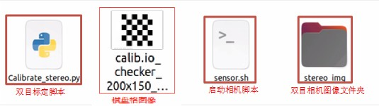


<center>图 5 sh 文件夹</center>


2.在 Calibrate 文件夹内，空白处，点击鼠标右键，打开一个终端，输入指令 `./sensor.sh`如图 6所示。敲击回车，等待 30s后会打开D435i相机。如果输入 `./sensor.sh`出现问题可以查看问题3。

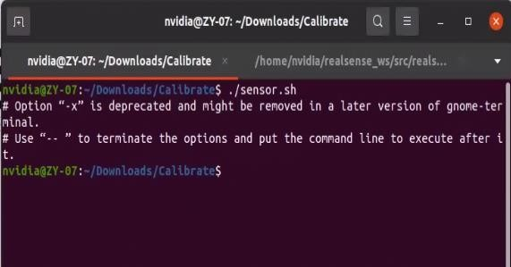


<center>图 6 运行 sensor.sh 脚本文件</center>


### 步骤三：传感器数据检查

1.运行传感器后需要查看传感器是否正确开启，对于前视相机正确开启后的消息打印如图7所示。

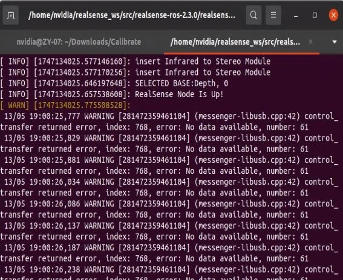


<center>图 7 前视相机的启动</center>


### 步骤四：进行标定

1. 在 Calibrate 文件夹下打开一个终端，输入指令 `python3 Calibrate_stereo.py` ，敲击回车运行程序。

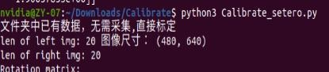


<center>图 8 Calibrate_stereo.py</center>


2. 如果 img_stereo 文件夹内没有图片，则需要手动采集，将标定板放置于相机前面如图 9 所示，可以看到左右相机图像，保证标定板完全出现在图像中。此时点击图像显示窗口按下键盘 s 键，就可以保存图像，终端中会显示 Saved stereo_img/image_left_X.png and stereo_img/image_right_X.png 如图 10 所示，每次保存图像均需要按下 s 键，按照下方标定方式移动标定板，如所示，并不断按下s键，直至保存一定数量的图像。

注：在保定过程中标定板摆放没有特定的顺序，只需要标定板在不同位置、不同角度、不同姿态下拍摄并保存这些姿态下的图像即可。可以按照上下，左右，前后分别移动标定板，

按照 yaw 轴，pitch 轴，roll 轴分别来回旋转标定板，如图 11 所示。保存下来的部分图像如图 12 所示。

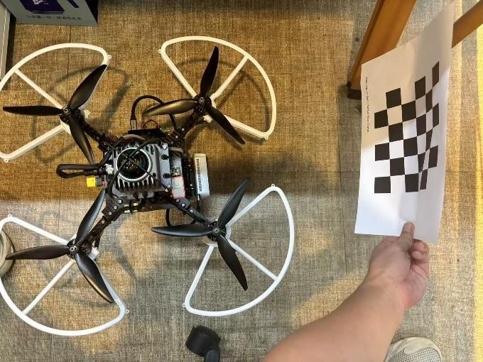


<center>图 9 标定方式</center>


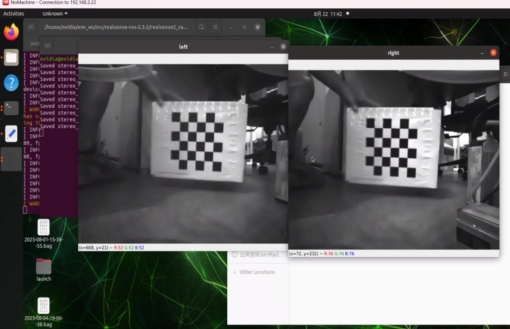


<center>图 10 双目标定</center>


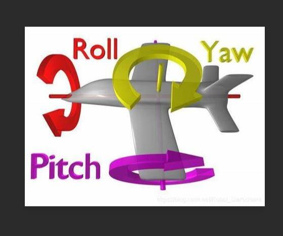


<center>图 11 三个姿态角旋转</center>


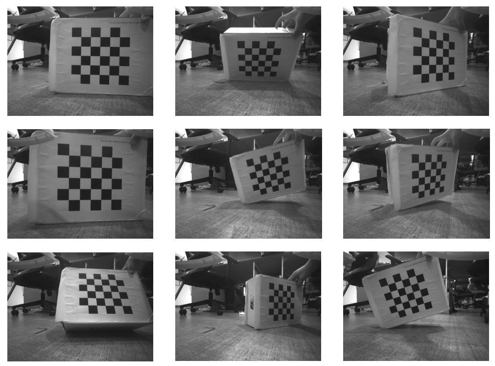


<center>图 12 部分采集的图像</center>


3. 当采集完一定数量的图像后就可以进行自动标定了，标定过程中会显示正在标定的图像，标定完成后终端会打印出标定的结果标定过程和结果如所示。

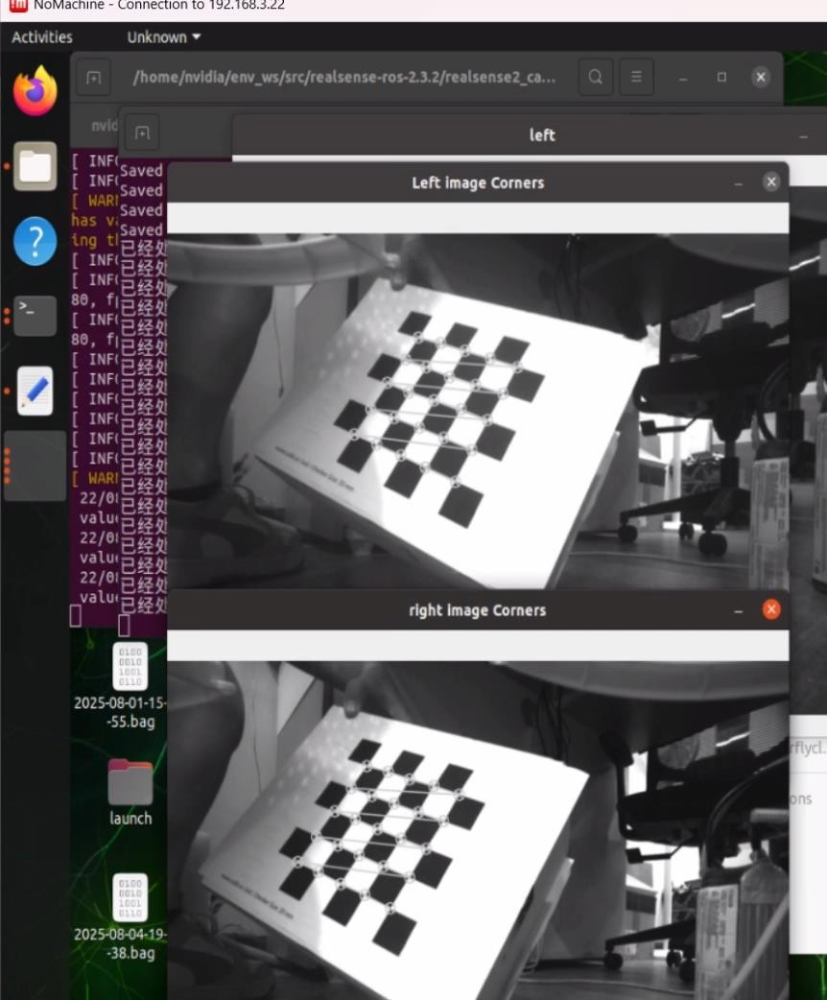


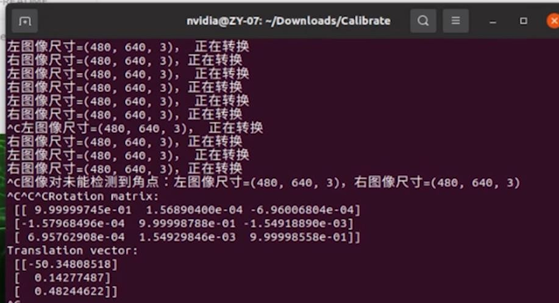


<center>图 13标定结果</center>


4. 如果 img_stereo 文件夹内有上次标定的图片，则不需要手动采集，此时会直接进行

标定，标定过程中会显示正在标定的图像，标定完成后终端会打印出标定的结果。

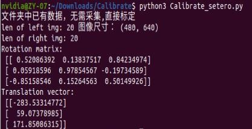


<center>图 14 双目标定结果</center>


### 步骤五：标定结果验证

1. 标定出旋转和平移矩阵之后，需要对标定结果进行验证。关闭传感器启动脚本打开的终端后，在任意位置打开一个终端，输入命令 `rs-enumerate-devices -c` 如图15所示，在打印的消息中找到 Extrinsic from "Infrared 1" To "Infrared 2" 所对应的旋转矩阵和平移矩阵如图16所示。

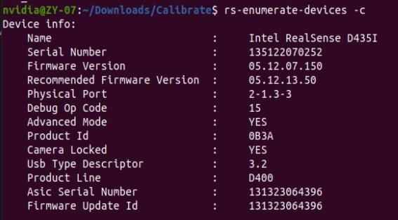


<center>图 15 输入 rs-enumerate-devices -c</center>


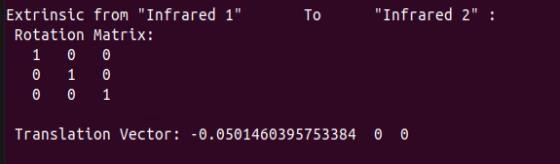


<center>图 16 左右目的旋转和平移</center>


2. 将标定的结果与打印出来的结果进行对比，发现旋转矩阵和平移矩阵的误差均在三位小数点之后，标定结果符合标准。


## 5、常见问题

Q1：nomachine 进入不了飞机远程端怎么办？

A1：查看飞机是否和本地电脑连接的是同一个局域网并核对好飞机（NX）ip重新尝试。

Q2：如何查看前视相机是否正常开启？

A2：运行启动传感器脚本后，在任意位置打开一个终端，输入 rviz 打开 rviz，接着在选择图像话题 \camera\color\image_raw 中的 image,同理也可以查看 \camera\infra1\image_rect_raw和 \camera\infra2\image_rect_raw 中的 image。

Q3：如果输入./sensor.sh 后出现 Permission Denied 报错问题怎么办？

A3：这是因为文件可能是从 windows里面放进去的，没有权限。在终端中输入 `sudo chmod777 *` ，接着输入密码 nvidia 赋予所有文件权限即可。

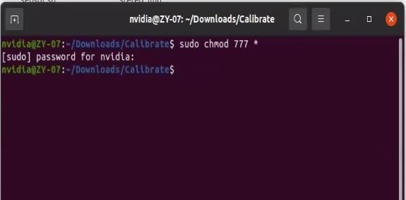

Q4:运行d435i的双目ROS节点的时候报错无法启动节点

A4：可以尝试使用
```bash
sudo apt install ros-$ROS_DISTRO-realsense2-camera
```
安装最新的d435i驱动


<center>图 17 赋予权限</center>

