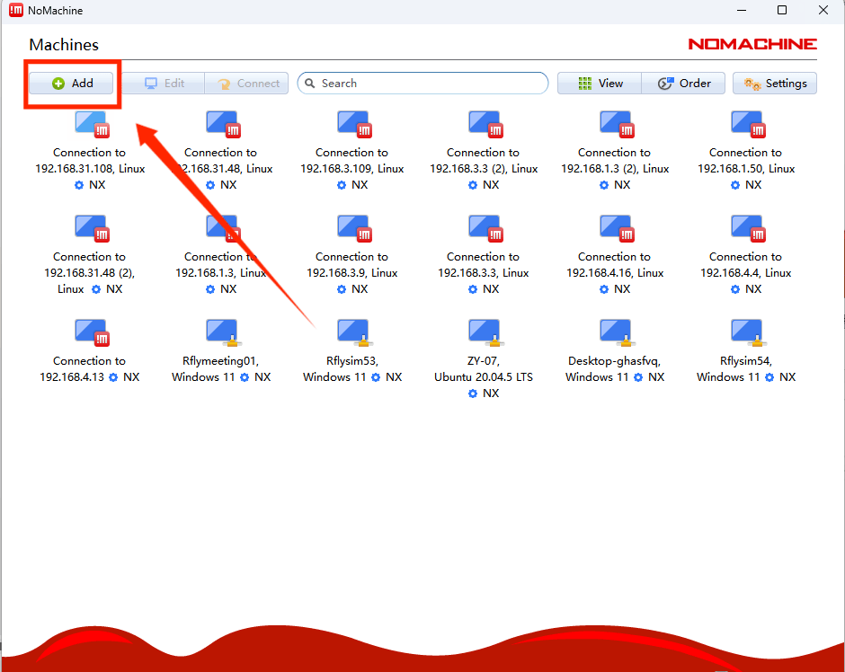
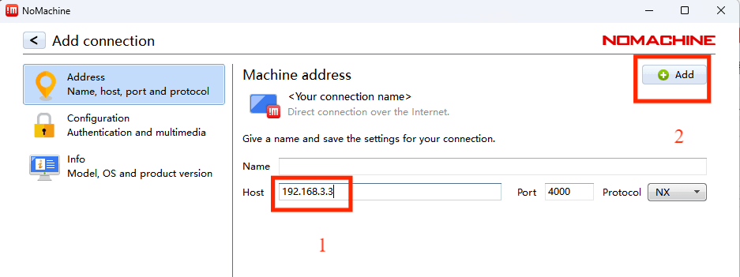
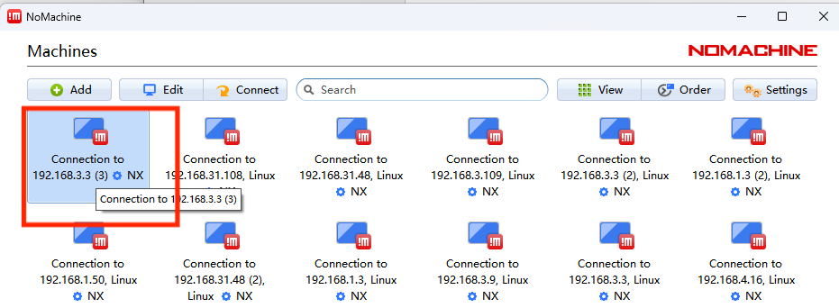
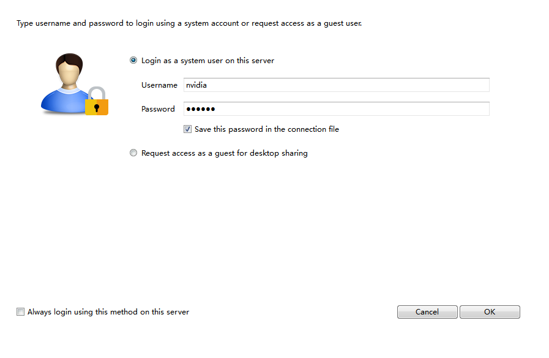
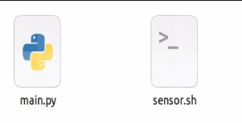
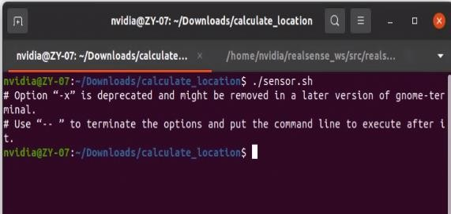
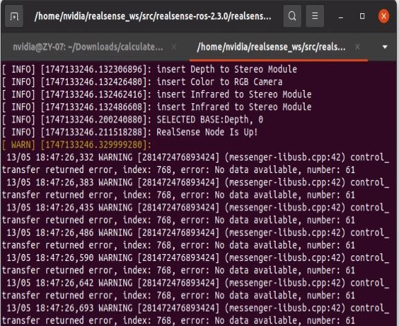
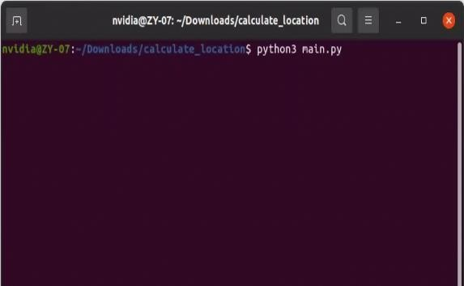
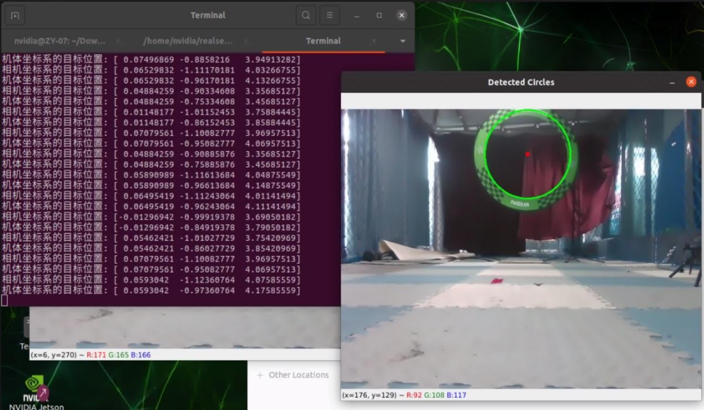
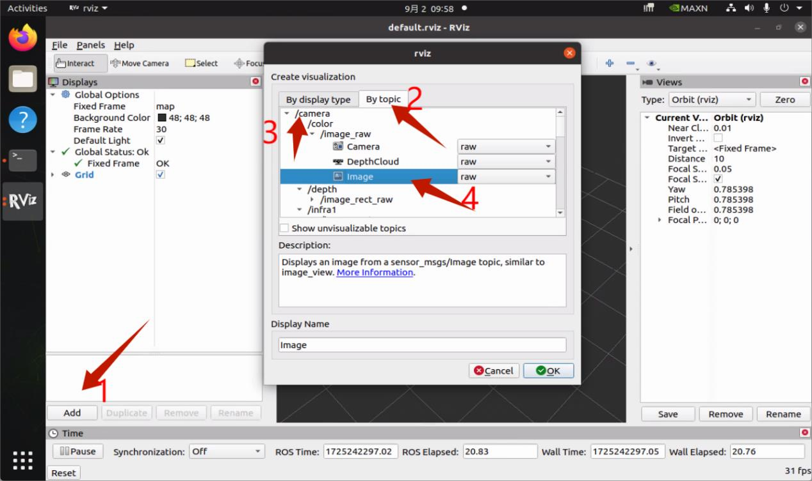

# 实验05_飞机目标解算实验

## 1、实验背景

随着无人机技术的发展，无人机在航拍、物流、农业、搜索救援等众多领域的应用日益广泛。在这些应用中，无人机需要准确感知和理解其周围环境，这依赖于视觉系统来获取和处理图像数据。通过解算目标的位置，无人机可以确定物体在三维空间中的绝对或相对位置，这对于机器人导航或无人机系统来说是至关重要的，因为它可以让系统识别并避免障碍物，或规划出到达目标位置的路径。

单目相机可以识别并跟踪目标物体，即使无法提供精确的三维位置信息，依然可以估算出目标的平面位置（例如在图像坐标系中的位置）。这对于自动化系统、监控系统和无人机等领域的目标跟踪功能至关重要。例如，在监控系统中，单目相机可以识别并跟踪进入画面的人或物体，并通过相对位置提供实时监控。

单目相机在静态情况下无法直接获得深度信息，但当相机发生运动时，通过图像序列的变化，可以利用运动视差（motion parallax）估算物体的深度。通常这种方法结合了光流（optical flow）技术，基于多帧图像中的物体移动轨迹来推断其深度信息。这种技术被应用在许多领域，包括无人机和自动驾驶中的环境感知。

在某些应用中，目标物体的实际尺寸已知。单目相机可以利用物体在图像中的大小以及与其他已知物体的相对比例来估算距离。 例如，自动驾驶系统可以通过已知的路标尺寸来估算车辆与路标的距离，从而辅助路径规划和行驶决策。

## 2、实验目的

本实验主要是利用D435i 相机进行目标位置解算，旨在让操作或实验人员熟悉 D435i相机的使用，并通过 ROS（Robot Operating System）系统将相机数据转发给计算程序，从而实现目标位置解算。实验的核心目的是通过实际操作，帮助实验人员掌握如何获取相机的深度信息以及彩色图像，并基于这些数据进行三维目标位置估算，最终实现目标物体在三维空间中的精确定位

## 3、实验环境

<table><tr><td rowspan="2">序号</td><td rowspan="2">软件要求</td><td colspan="2">硬件要求</td></tr><tr><td>名称</td><td>数量(个)</td></tr><tr><td>1</td><td>Windows 10 及以上版本</td><td>笔记本①</td><td>1</td></tr><tr><td>2</td><td>Wifi 路由器</td><td></td><td>1</td></tr><tr><td>3</td><td>卓翼 310 飞机以及相关配件</td><td></td><td>1</td></tr><tr><td>4</td><td>场地设施配置</td><td></td><td>1</td></tr><tr><td>5</td><td>飞思视觉仿真平台</td><td></td><td>1</td></tr></table>

① ：推荐配置请见：https://rflysim.com/doc/zh/1/InstallLearn.html

## 4、实验步骤

### 步骤一：连接 nomachine

1. 在笔记本或者本地电脑端打开 nomachine进入连接页面如图1所示。

图 1 nomachine 连接页面图

2. 点击左上角 add按钮进入编辑连接界面，在 Host处输入飞机 ip地址，点击右上角add后回到连接页面，如图2所示。

图 2 nomachine 编辑连接页面图

3. 双击要连接的飞机 ip 后既可进入 NX 远程界面，如图 3 所示。如果显示连接问题具体请参考：问题 1。

图 3 nomachine 连接飞机

4. 在账号密码界面输入账号nvidia和密码nvidia后点击OK后一直点击OK即可进入飞机远程。

图 4 输入账号密码

### 步骤二：启动传感器

1.进入/home/nvidia/Downloads/calculate_location 文件夹，可以看到多个文件如图 5 所示。其中 `sensor.sh` 是开启相机脚本，`main.py` 是进行定位飞行的脚本。

图 5 calculate_location 文件夹

2.在文件夹内空白处，点击鼠标右键，打开一个终端，输入指令 `./sensor.sh`如图 6所示。敲击回车，等待30s后会打开启动所有传感器的控制程序。

图 6 运行 sensor.sh 脚本文件

### 步骤三：传感器数据检查

1. 运行传感器后需要查看传感器是否正确开启，对于前视相机正确开启后的消息打印如图7所示。

图 7 前视相机的启动

### 步骤四：启动目标解算程序

1. 在文件夹下打开一个终端，输入指令 `python3 main.py` ，敲击回车。

图 8 目标解算程序

2. 可以看到飞机相机中的图像检查出圆环和圆环中心，并在终端中打印出圆环位置。

图 9 目标追踪图

## 5、常见问题

Q1：nomachine进入不了飞机远程端怎么办？

A1：查看飞机是否和本地电脑连接的是同一个局域网并核对好飞机（NX）ip重新尝试。

Q2：如何查看前视相机是否正常开启？

A2：运行启动传感器脚本后，在任意位置打开一个终端，输入 `rviz` 打开 rviz，接着在选择图像话题 \camera\color\image_raw 中的 image。

Q3：如果输入`./sensor.sh` 后出现 Permission Denied 报错问题怎么办？

A3：这是因为文件可能是从 windows里面放进去的，没有权限。在终端中输入 sudo chmod777 * ，接着输入密码 nvidia 赋予所有文件权限即可。