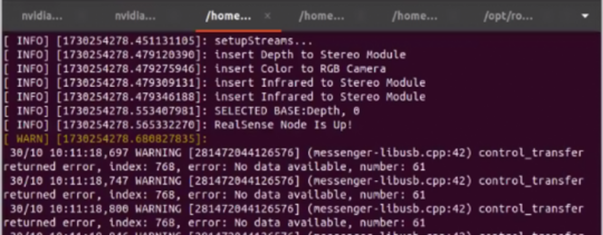
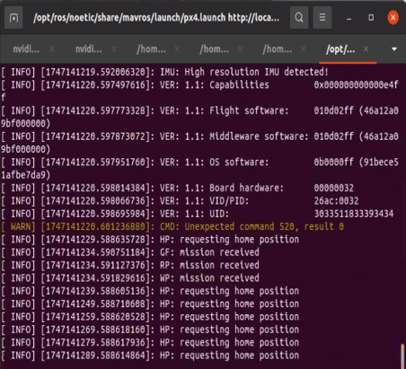

# 实验06_目标跟踪实验

## 1.实验原理与说明

KCF（Kernelized Correlation Filters）算法是一种基于相关滤波（Correlation Filter）的目标跟踪方法，其核心思想是利用卷积操作提升目标跟踪的效率和鲁棒性。下面是KCF算法的实验原理解释： 
- 相关滤波基础：相关滤波是一种通过卷积操作计算目标和背景的相似度的技术。在目标跟踪中，通常通过计算目标模板与视频帧中的各个位置的相似度来判断目标的位置。传统的相关滤波方法通过计算每个位置的内积来得到匹配度，但这种计算在大规模数据集上非常耗时，因此KCF算法引入了“核方法”来加速计算。
- 引入核方法（Kernel Method）：KCF算法采用了核方法（Kernel Method）来在高维特征空间进行目标的表示。这意味着算法通过对输入图像进行非线性映射，能够在更高维度的空间中处理复杂的目标特征，从而提升跟踪的准确性和鲁棒性。
- 线性滤波器：假设图像中的目标是通过一个线性滤波器表示的，KCF算法通过优化该滤波器来最大化模板与目标图像的相似度。
- 核技巧：传统的线性相关滤波在处理非线性数据时存在局限，KCF通过引入核方法（如高斯核函数），使得其可以在更高维空间中找到数据的潜在结构，进而提高目标跟踪的精度。 
- 频域计算：KCF算法通过将图像从时域转换到频域来加速计算。在频域中，卷积操作变成了乘法操作，这使得卷积的计算变得更加高效。KCF通过快速傅里叶变换（FFT）来在频域中执行卷积，从而大大提高了计算速度。

## 2.实验步骤

### 2.1 使用nomachine连接飞机（同先前实验）
### 2.2 程序文件
在/Home/Download/object tracking/sh文件夹，其中start.sh是开启相机和mavros（与地面站进行通信的节点）的脚本
### 2.3. 终端中运行命令
```bash
  ./start.sh
```
等待30s后会启动所有传感器

接下来检查前置摄像头启动是否正常



检查飞控状态


### 2.4 启动跟踪
新开一个终端
```bash 
  python3 test.py
```
然后在打开的窗口中框选要跟踪的物体
