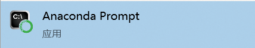
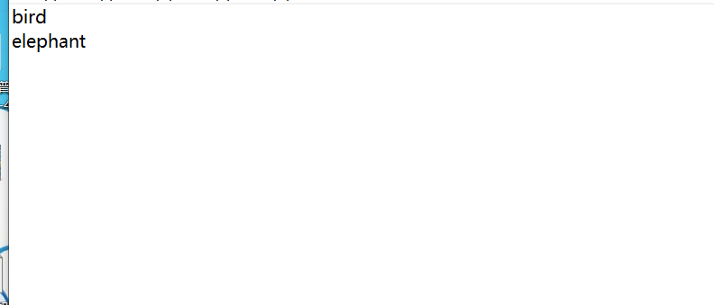
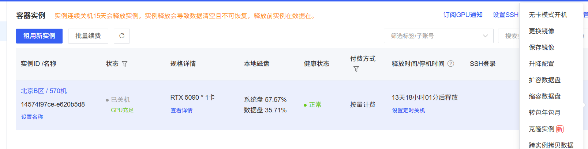

# YOLO模型的训练

​     如果自己电脑有高算力显卡就用自己电脑训练就好，就由于我自己显卡算力不够，数据集图像增强之后可能会有几万张图片，流程介绍使用云算力平台租GPU训练。

​    算力平台可以使用智星云或者AutoDL，智星云相对便宜但是功能不如后者齐全，在不买网盘的额外权益包的情况下传输文件也不如后者方便，甚至会将更多时间浪费在传输大体量数据集上，因此使用AutoDL平台（支持无卡模式开机  配环境的时候可以几分钱一小时）。

​    使用最新版YOLO26进行训练。Python版本最低为3.8，推荐3.10或3.11，PyTorch >= 1.8。

## 1. 准备的前置

1. 显存比较大的显卡用来训练模型
1. Annaconda软件。用来创建管理python虚拟环境，防止用到不同版本的python时把自己电脑的base环境弄得乱七八糟。
1. 较大量的数据集  （之后还要图像增强）

## 2. 图像标注（在自己电脑上完成 不需要高算力）

​    训练之前要先对图像进行标注，告诉电脑要识别的对象在哪里以及这个对象的类别。使用图像标注工具Labelimg进行标注。   因为Labelimg要求python版本<=3.9，还挺低的，那就使用Anaconda创建一个python=3.9的虚拟环境(anaconda怎么装自行搜教程).

1. 安装anaconda

2. 打开Anaconda Prompt  输入`conda create -n labelimg python=3.9`创建一个叫做labelimg，python版本是3.9的虚拟环境，conda会自动下载好需要的python。首次操作可能会提示需要同意两个更新的条款 输入如下两行即可。如果下载太慢，自行查看切换到清华源或者阿里源的教程。

   ```
   conda tos accept --override-channels --channel https://repo.anaconda.com/pkgs/r
   conda tos accept --override-channels --channel https://repo.anaconda.com/pkgs/msys2
   ```

   

3. 创建完虚拟环境就可退出Anaconda Prompt，使用终端（Terminal）了。先运行`conda init powershell`初始化终端的conda，关闭终端重新进入就可以使用conda了，输入`conda activate labelimg`进入虚拟环境。
4. 在虚拟环境下输入`pip install labelimg`安装labelimg工具。同样地，如果太慢，自行切换清华源。
5. 装好之后在终端输入`labelimg`，就可以打开图像标注工具了、
6. 准备好需要标注的数据集 ，按照下面描述的层级图摆放等待标注的数据集。自己在labels文件夹下创建好字典文件classes.txt。

```
标注工作目录 (Annotation_Workspace)/
│
├── images/                  <-- 存放所有待标注的原图
│   ├── uav_cam_001.jpg      
│   ├── uav_cam_002.jpg
│   └── uav_cam_003.jpg
│
└── labels/                  <-- LabelImg 软件保存 YOLO 格式 .txt 的目标文件夹
    ├── classes.txt          <-- 【字典文件】必须在这里！定义 0=bird, 1=deer 等（给labelimg看的）
    ├── uav_cam_001.txt      
    ├── uav_cam_002.txt      
    └── uav_cam_003.txt     
```



<center>字典文件如图 第一行表示0映射成bird 第二行表示为2映射成elephant 以此类推</center>

7. 标注完成之后使用脚本将所有数据集按照8：1：1的比例划分为训练集，验证集，和测试集。
8. 将训练集和测试集打包，准备上传到AutoDL云电脑的硬盘上，测试集留在本地就好，不能用来训练，否则将失去测试训练效果的数据集。 

## 3. 云电脑训练环境搭建

云电脑理应已经装好了conda和且有高版本的CUDA，可以直接开始创建yolo26用到的虚拟环境。

1. 先创建一个实例，选择高显存的显卡，这里选择5090。

2. 在控制台侧边栏点击文件存储，选择自己实例所在的大区，上传打包好的数据集文件。上传完再开机即可。

3. 之后开始配置环境。因为配置环境不需要高性能显卡，先选择无卡模式开机，省钱。

   

4. 在自己电脑上打开终端，分别复制输入ssh登录处的登录指令和密码进行远程连接。

5. 连接成功后直接用conda创建yolo26的虚拟环境，`conda create -n yolo26 python=3.10`

6. 激活虚拟环境`conda activate yolo26`

8. 在虚拟环境安装yolo26  `pip install ultralytics tqdm albumentations -i https://pypi.tuna.tsinghua.edu.cn/simple`这个过程还会自动下载合适版本的PyTorch和CUDA的软件安装包，需要下载的文件比较大，所以使用清华源进行安装。安装完之后环境就算配置完了，还挺简单的。

## 4.图像增强

​    光使用实际拍的数据集训练出来的模型是不够的。为了使训练好的模型在光照差，角度刁钻，比较小，无噪点，模糊等较差环境下也能发挥很好的的效果，需要对数据集进行图像增强。可以使用AI写脚本把图片旋转不同角度，添加噪声，模糊效果等。因增强方式多样 ，图像增强会让数据集规模指数增长。所以图像增强在云电脑上进行。

1. 把打包的数据集转移到读取速度最快的磁盘。解压`unzip -q dataset.zip -d dataset //把datastet.zip静默解压到dataset文件夹`。
2. 编写图像增强脚本，对图片进行图像增强。注意图像增强时训练集，验证集，以及测试集都要进行增强并且保持比例不变。

## 5.开始训练


图像增强之后准备工作就完成了，可以开始训练。

现在来看一下增强后数据集的文件结构

```
/root/dataset/
├── train/   
|     ├── images
|     └── labels
└── val
      ├── images
      └── labels
```


1. 先在dataset目录下编写一个`data.yaml`文件。这个文件是给yolo看的，指出训练集和验证集的目录和类别映射。

```
path: /root/dataset  # 这里的路径一定要改使用Linux 的绝对路径

# 训练集和验证集的子目录路径
train: train/images     #只要指出图片文件夹就好 yolo会自动寻找标签文件夹
val: val/images

#类别映射
names:
  0: peacock
  1: wolf
  ......
```


2. 因为直接使用终端训练一旦终端被关掉或者因为连接不稳定而断开的话训练就会终止，使用`LANG=en_us.UTF-8 screen -S train`创建叫做train的screen进行训练，即使关掉终端下次重新进入仍可以看到任务在进行。 下次使用`screen -r train`进入

3. 在screen里进入虚拟环境 `conda activate ...`忘记自己的环境名字用`conda env list`查看

4. 开始训练`yolo task=detect mode=train model=yolo26m.pt data=/root/dataset/data.yaml epochs=100 batch=16 imgsz=640 amp=True device=0 degrees=10.0 scale=0.5 mosaic=1.0 mixup=0.1 project=final name=run workers=8&&shutdown`   

   - 因为机载电脑算力够强  使用yolo26的middle体量模型，运行命令时会自动下载yolo26m.pt。

   -  如果太慢 可以在自己电脑上从github上下载模型文件然后传到云电脑。

   - 进行100轮训练 。

   - 即使使用5090，训练集图片也太多了，batch=16可有效防止爆显存。

   - 开启AMP，优化训练质量和效果，但是使用amp的话即使你指定使用midlle体量模型它也会自动下载个nano体量的进行验证，不必担心。

   -  其中scale mosaic  mixup参数是在训练的过程中再次进行图像增强来达到更好效果。

   -  结果会模型保存在工作目录的final/run1文件夹里 。训练完会自动关机，防止持续计费。

5. 开始训练后可使用Ctrl+A+D键退出screen 之后可关闭终端，训练仍会继续，下次运行`screen -r train`可再次进入查看。

## 6.验证的得到的模型


`yolo val model=runs/detect/train/weights/best.pt data=data.yaml split=test`会调用best.pt模型去验证data.yaml里写好的test路径里的图片 。

接下来就是把训练好的.pt文件在机载电脑上转换成契合机载电脑的.engine文件，检测的效率非常高。
